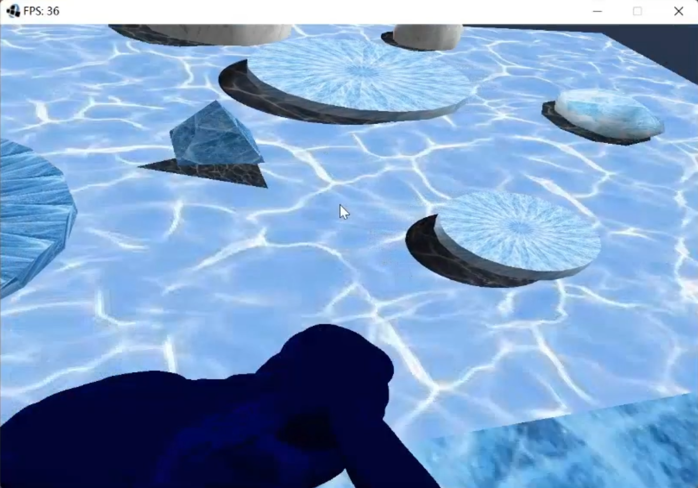
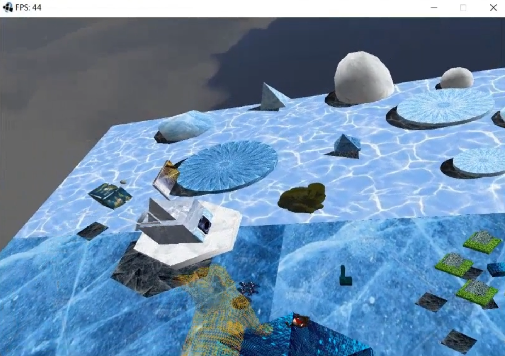

# Control and Interactions

## View and Camera
Change the perspective of the view by moving the mouse after left click. 
Up, left, right, down arrow buttons changes the position of the camera.
(Please change the position of the camera if you don't like the original perspective).

## Player Movement (Gun)

UHJK to move. Space to jump. Right click to shoot bullets. 
O to God Mode. Y for up and I for down within the God Mode.
0 to reset the position of the player.
The camera moves with the player movement.

## Interactive Elements
The bunny changes color when hit by bullets.
The enemy beside the cat can throw the gun down to the ground if the gun hits it (following physics law).
The player can tour the whole scene by just controlling the camera, as First People Perspective.

Video: https://share.weiyun.com/9RQFFtyM

